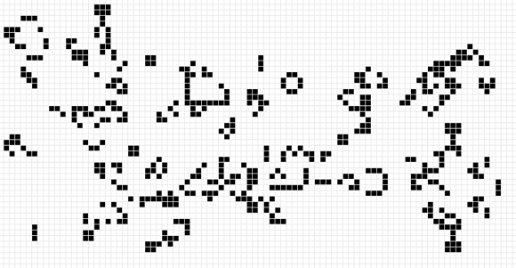
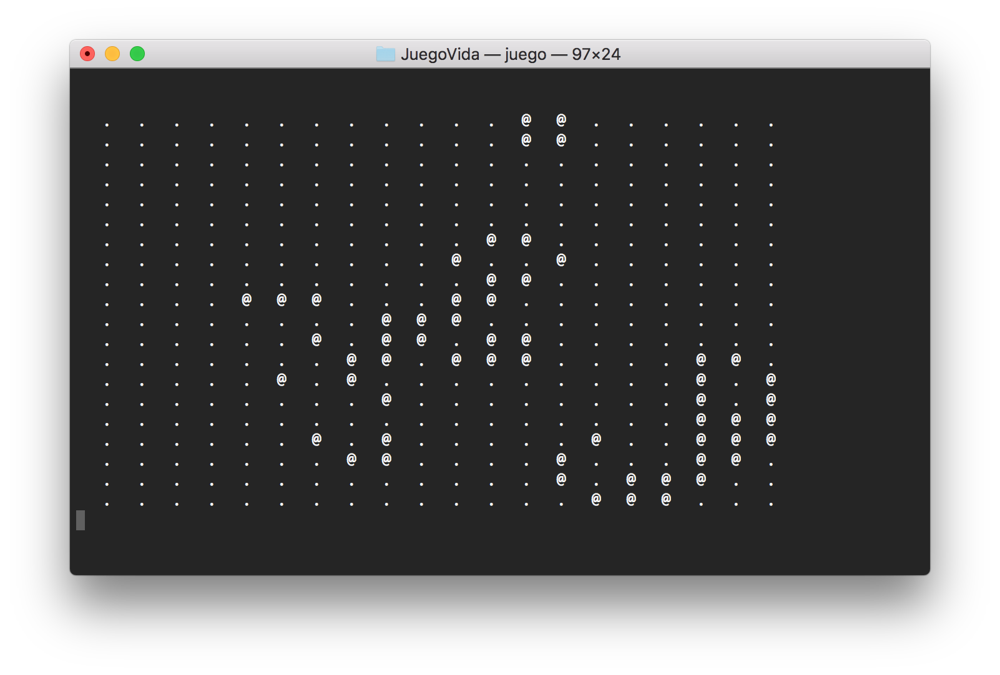

# EL juego de la vida
Proyecto 1: El Lenguaje de Programación C.
### Integrantes:
#### Samuel Arturo Garrido Sánchez
#### Fernando Maceda Patricio

*Pequeña wiki The Game of Life by Conway*

El juego de la vida de Conway es el autómata celular más conocido y más estudiado, diseñado por el matemático John Horton Conway en 1970. El juego es un autómata celular bidimensional en el cual cada celda (célula) puede estar en uno de los dos estados posibles, viva o muerta. Partiendo de un estado inicial, la simulación va haciendo evolucionar al autómata en base a unas sencillas funciones de transición. Una célula va a estar en un estado concreto, el cual será determinado únicamente del estado inmediatamente anterior de las células vecinas y el de la propia célula, tal y como se describi´o en la sección de autómatas celulares.

### Patrones:
Un patrón es una configuración de células vivas que permanece estable. Existen básicamente tres clases de patrones en el juego de la vida de Conway. 
- Patrones estáticos: Un conjunto de células vivas que se mantiene estático, sin que se produzcan nuevos nacimientos o muertes.
- Patrones recurrentes: Un conjunto de células vivas que no se mueve por el mundo, pero que no es estático, ya que se producen nacimientos y muertes, produciendo transiciones que se repiten continuamente.
- Patrones que se trasladan (spaceships): Un conjunto de células vivas que permanece con la misma forma, pero que se desplaza por el tablero.

Es considerado un Turing completo, para más información: Sistemas formales y autómatas.

### Funciones importantes: 
- SinVidaSocialProteco: es la función más importante ya que llama a las demás y checa la condición de los vecinos mencionado anteriormente. (2, 3, menor a 2 o mayor a  3). Se usa una tabla aux
- ImprimirMatriz: Imprime la matriz generada además que puede cambiarse los símbolos que quiere que muestre las vivas y las muertas en printf("   .")  y printf("    @")
- Vecinirijilos: Estando en una celda de la tabla checaremos los o vecinos que tiene con hor y vert que decrecen o crecen en +-1 lo que nos permite ver los vecinos y la condición más anidada para que no caigamos en tablero[-1][-1] que es salirnos de la memoria asignada.
-  regarBendiciones: Pone de manera aleatoria las células vivas en el tablero
- poneren0s: Nos pone el tablero en ceros.

La matriz se maneja a manera de apuntadores de apuntadores para cubrir ese apartado de apuntadores.

### ATENCIÓN: Posee funciones del sistema de UNIX-Like de system("clear") por lo que su ejecución en Windows o MS-Dos será con system("cls")

### Ejecución:

